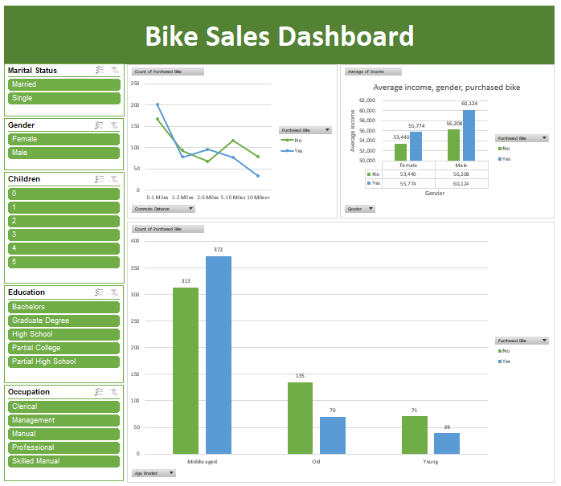

# Bike Sales Dashboard

* Data wrangling:

    * spelling correction
    * expanding acronyms
    * dealing with empty cells and `NULL`s
    * using **Filters** for finding anomalies
    * using basic **Formulas** for manipulating data

* **Pivot Tables** to obtain subsets of data

* **Pivot Charts** and **Slicers** to create an interactive **dashboard**.

* Screenshot of final dashboard:

